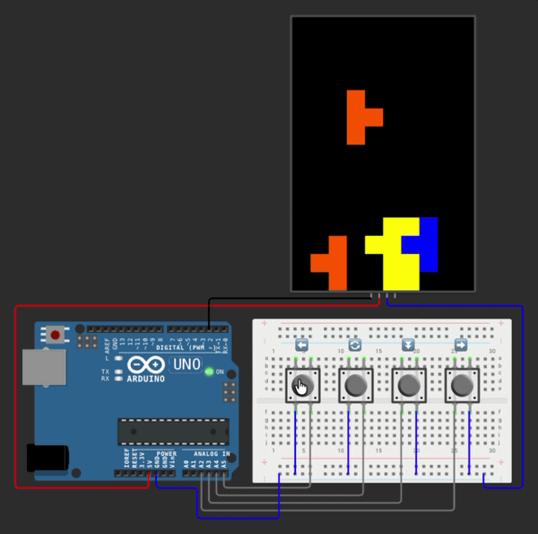

# Arduino Tetris (WOKWI)

Simulation of a simplified Tetris game running on Arduino.

## Components 

- Arduino Uno
- Half Breadboard
- LED Matrix (WS2812 / NeoPixel)
- Pushbutton (4)

## Features

- Classic falling block gameplay
- Randomly generated pieces
- Piece rotation and horizontal movement
- Accelerated falling
- Automatic line clearing
- Progressively increasing game speed
- Game reset when the board is full

## Controls

- Left button: move piece left
- Right button: move piece right
- Rotate button: rotate piece
- Speed button: accelerate piece fall

## Test

Test the project on Wokwi:
https://wokwi.com/projects/458211907126636545
